## Overview of the Project

The purpose of this project is to assist a client who is interested in offering a new cryptocurrency investment portfolio for its customers. The company has requested a report that includes what cryptocurrencies are on the trading market and how they could be grouped to create a classification system for this new investment.

The data is not ideal, so it will need to be processed to fit the machine learning models using unsupervised learning grouping and a clustering algorithm. 

There are four technical analysis deliverables:

Deliverable 1: Preprocessing the Data for PCA
Deliverable 2: Reducing Data Dimensions Using PCA
Deliverable 3: Clustering Cryptocurrencies Using K-means
Deliverable 4: Visualizing Cryptocurrencies Results

## Results

### Deliverable 1: Preprocessing the Data for PCA

The data was preprocessed to eliminate unnecessary data:

- Keep all the cryptocurrencies that are being traded

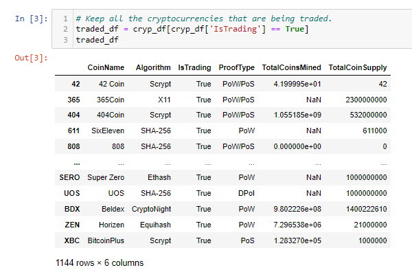

- Keep all the cryptocurrencies that have a working algorithm

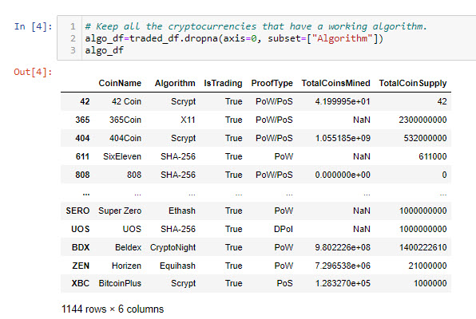

- Remove the "IsTrading" column

- Remove rows that have at least 1 null value

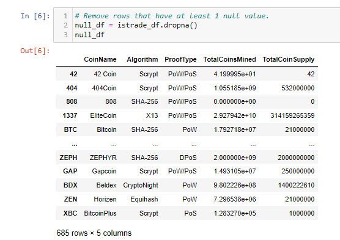

- Keep the rows where coins are mined

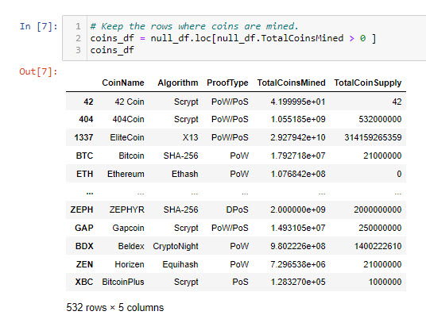

- Create a new DataFrame that holds only the cryptocurrencies names

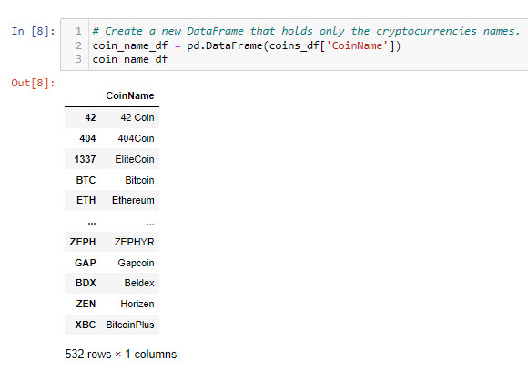

- Drop the 'CoinName' column since it's not going to be used on the clustering algorithm

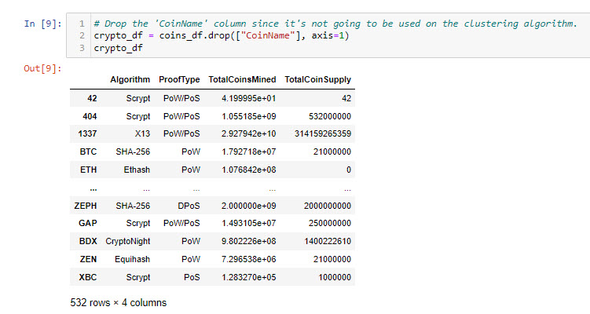

- Use get_dummies() to create variables for text features

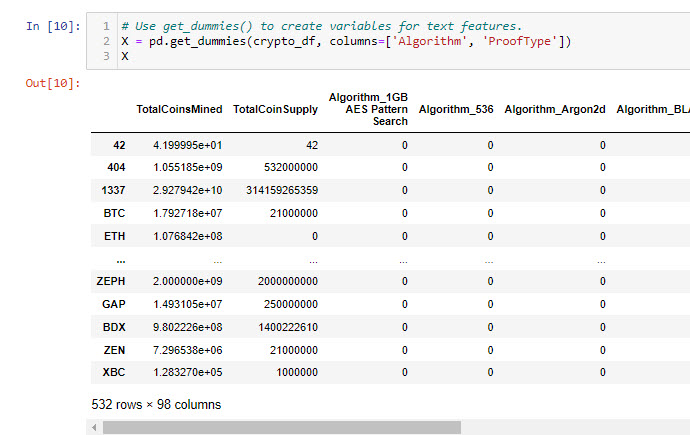

- Standardize the data with StandardScaler()

### Deliverable 2: Reducing Data Dimensions Using PCA

- Using PCA to reduce dimension to three principal components

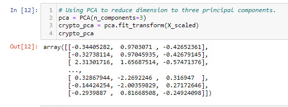

- Create a DataFrame with the three principal components

### Deliverable 3: Clustering Cryptocurrencies Using K-means

- Create an elbow curve to find the best value for K and find the best value for K

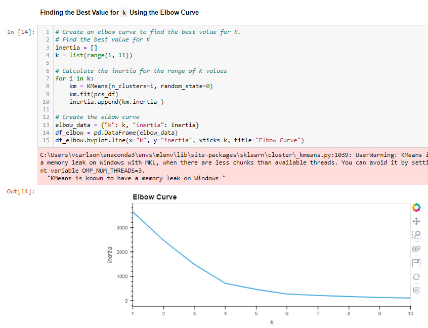

- Run K-Means with k=4

### Deliverable 4: Visualizing Cryptocurrencies Results

- Creating a 3D-Scatter with the PCA data and the clusters

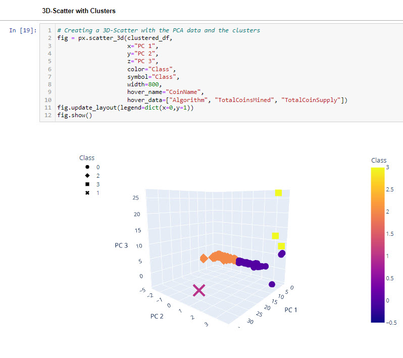

- Create a table with tradable cryptocurrencies

- Print the total number of tradable cryptocurrencies

- Scaling data to create the scatter plot with tradable cryptocurrencies

- Create new DataFrame with scaled data, add CoinName and Class columns

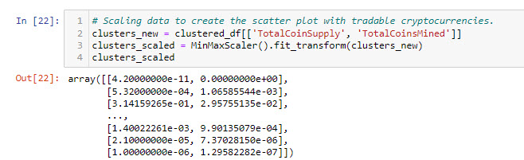

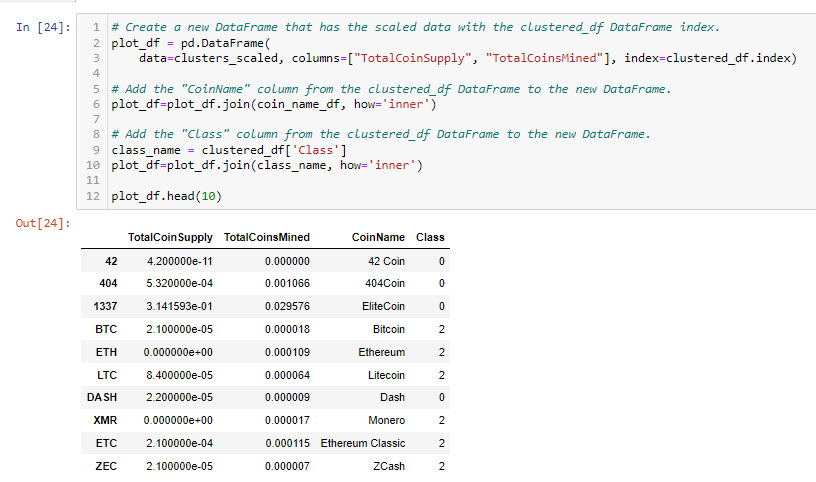

- Create a hvplot.scatter plot using x="TotalCoinsMined" and y="TotalCoinSupply"

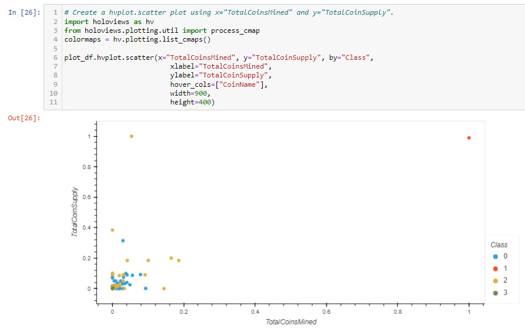

## Summary

The cryptocurrencies were divided into 4 groups, with the majority of the cryptocurrencies falling into groups 0 and 3.